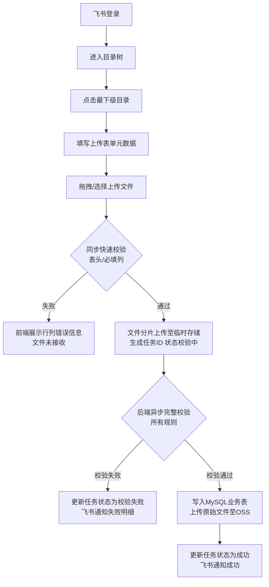
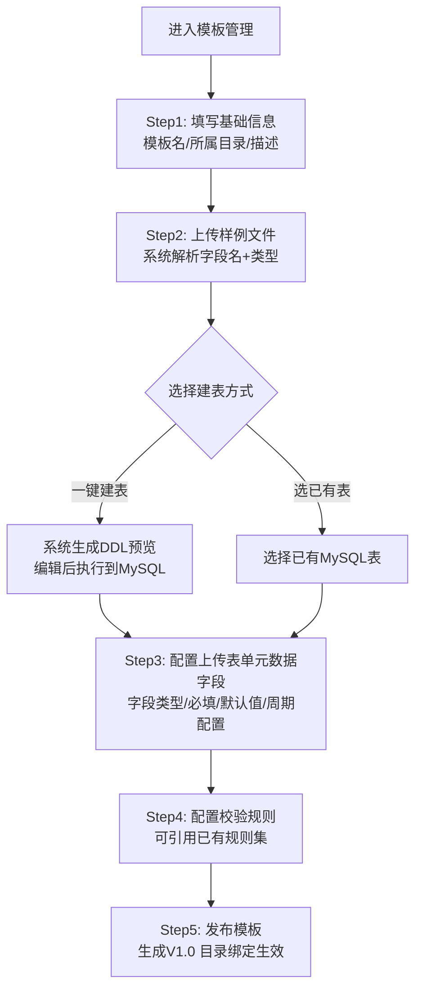
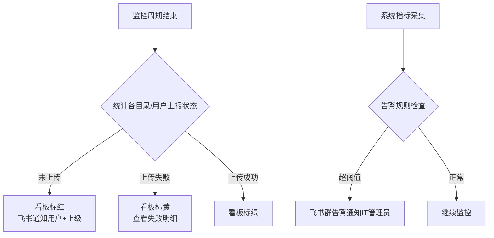

# 【产品方案】文件上传系统

> **AI 阅读指引**：本档聚焦于"业务逻辑"与"业务闭环"。请基于此文档理解业务意图，支撑后续技术架构设计。请勿在此包含具体的代码实现或 API 定义，以确保逻辑解耦。

---

## 0. 文档基本信息

| 字段 | 内容描述 |
| :--- | :--- |
| **文档版本** | V1.0 |
| **产品负责人** | — |
| **文档状态** | 草案 |
| **最后更新时间** | 2026-04-28 |

---

## 一、需求概览

### 1.1 业务背景

- **业务现状**：国货美妆集团各业务部门（产品营销、渠道营销、品牌等）需定期向数据中台上报经营数据、营销数据，目前通过人工方式分散上报，缺乏统一入口。
- **核心痛点**：
  - 填报不及时：无统一监控和提醒机制，漏报情况频发。
  - 文件格式错误：字段名称不规范、表头不一致，导致数据异常。
  - 学习成本高：业务人员需了解数据表结构，IT介入频繁。
  - 可追溯性差：无历史上传记录，问题难以定位和回溯。

### 1.2 一句话量化目标

通过**统一文件上传系统**，解决**各业务线上报人员**的**填报不规范、监控缺失**问题，达成**业务用户自助上传成功率 ≥ 95%，IT介入次数降为 0（除模板变更）**。

### 1.3 核心要解决的业务问题

1. **文件格式不规范**：表头不一致、字段类型错误导致数据异常频发 | 严重等级：高
2. **填报不及时、无监控**：无法感知哪些目录/用户未按期上报 | 严重等级：高
3. **IT介入成本高**：业务用户每次上报都需IT协助处理异常 | 严重等级：高
4. **数据可追溯性差**：无历史记录，无法回溯问题文件 | 严重等级：中
5. **大文件上传体验差**：单文件可达 2GB，无断点续传支持 | 严重等级：中

### 1.4 核心业务指标 (KPI)

| 指标名称 | 当前现状值 | 目标参考值 | 计算口径 |
| :--- | :--- | :--- | :--- |
| 业务用户自助上传成功率 | 未知（人工上报） | ≥ 95% | 成功任务数 / 总任务数 |
| IT介入次数（除模板变更） | 高频 | 0 | 人工处理工单数 |
| 上传监控告警覆盖率 | 0% | 100% | 已配置监控目录数 / 全部目录数 |
| 单文件 2GB 上传完成时间 | — | ≤ 10 分钟（标准办公网） | 上传开始到任务成功的耗时 |
| 数据文件保留周期 | 无自动清理 | 3 个月自动清理 | 文件存储时间 |

---

## 二、流程与逻辑描述

### 2.0 用户与场景 (Persona & Scenarios)

**核心角色**：

| 角色 | 说明 | 典型操作 |
| :--- | :--- | :--- |
| IT 管理员 | 负责系统配置、模板管理、监控规则 | 创建/编辑模板、配置校验规则、管理目录/用户授权、查看监控看板、设置告警 |
| 业务用户 | 各业务线/品牌/部门的上报人员 | 在授权目录下上传文件、查看自己的上传历史、接收飞书通知 |

**触发场景**：
- IT 管理员：通过 PC Web 后台，进行模板创建、目录配置、权限分配、监控看板查看。
- 业务用户：每日/每周/每月固定周期，通过 PC Web 飞书登录后，进入授权目录上传业务数据文件（Excel/CSV）。

### 2.1 需求清单 (Requirement List)

**功能需求**：
- 飞书 OAuth2.0 统一登录，无需独立密码。
- 多级目录结构管理，最下级目录绑定唯一模板。
- 模板创建 5 步向导：基础信息 → 样例上传与建表 → 上传表单配置 → 校验规则配置 → 发布。
- 模板版本管理（自动版本号、变更日志、不可删除）。
- 支持模板完整复制和校验规则集引用。
- 文件上传：拖拽/点击上传，单次最多 40 个文件，支持 .xls/.xlsx/.csv，单文件 ≤ 2GB。
- 分片上传 + 断点续传。
- 同步快速校验（表头、必填列） + 异步完整校验（全部规则）。
- 丰富的校验规则：表结构、字段类型、枚举值、正则、数值范围、跨列依赖、文件内唯一性、与目标表唯一键冲突处理、脏数据阈值。
- 字段映射界面：自动同名连线、手动连线、常量映射、跳过字段。
- 一键建表：根据样例文件生成 MySQL DDL，支持编辑后执行。
- 上传历史列表：按目录隔离展示，支持过滤、分页。
- 上传监控看板：按周期统计各目录/用户上报状态（红/黄/绿），支持导出报表。
- 定时提醒：截止前飞书通知业务用户及其上级。
- 飞书告警：异步处理失败、监控触发、系统告警、规则执行异常等多场景。
- 告警规则后台可配置（失败率、处理耗时、队列堆积、并发数、存储失败次数）。
- 操作审计日志：模板变更、权限变更、用户登录，保留 1 年。

**非功能需求**：
- 并发上传用户数 ≥ 50。
- 历史列表查询响应 ≤ 2 秒（百万级记录）。
- 同步校验 ≤ 2 秒。
- 数据预览（前 10 行）≤ 1 秒。
- 服务无状态，支持水平扩展。
- 异步队列持久化，服务重启不丢任务。
- 原始文件服务器端保留 3 个月，到期自动删除。

### 2.2 核心业务流程

#### 业务用户上传流程



#### IT 管理员模板创建流程



#### 监控与告警流程



### 2.3 业务状态机（上传任务）

```
等待校验 → 校验中 → 校验失败（终态）
                  → 处理中 → 成功（终态）
                           → 部分失败（终态）
                           → 失败（自动重试最多3次后终态）
```

### 2.4 核心功能业务详情

#### 模板管理

- **模板创建（5步向导）**：
  - Step1 基础信息：模板名称（目录内唯一）、所属最下级目录、描述。一个目录只能绑定一个模板。
  - Step2 样例上传与建表：上传 ≤100 行样例文件，自动解析字段名和数据类型；支持勾选字段后一键生成 MySQL 建表语句（弹窗预览并可编辑后执行）；也可选择已有 MySQL 表。
  - Step3 上传表单配置：配置上传时需要填写的元数据字段（如"费用发生月份"、"投放工具"），支持文本/数字/日期/单选/多选/下拉框类型，可设置必填、默认值、选项列表、校验规则；字段顺序可拖拽；系统内置快捷示例字段。同时配置上传周期（日/周/月）及执行人。
  - Step4 校验规则配置：可从已有模板导入规则集；逐条配置开关和参数（详见校验规则章节）。
  - Step5 完成与发布：保存模板，状态更新为"已发布"，生成 V1.0；发布后不可删除，仅可停用或新建版本。
  - **字段映射**（Step2 建表后配置）：左右两列分别展示文件字段和目标表字段；自动同名连线（忽略大小写/空格）；支持手动连线；支持常量映射（固定赋值）；支持跳过字段（某列不写入数据库）。

- **模板版本管理**：系统自动递增版本号（V1.0、V1.1、V2.0）；业务用户始终使用最新发布版本；版本变更记录操作人、时间、变更内容，不可删除。

- **模板复制与规则引用**：支持完整复制模板（含所有配置）；支持在校验规则步骤中从已有模板导入规则集（一键覆盖或合并）。

- **模板增删改停用**：已发布模板不可删除，仅可停用或新建版本；模板名称在目录内唯一。

#### 校验规则（按执行顺序）

| 校验类别 | 说明 | 是否必要 |
| :--- | :--- | :--- |
| 表头字段名称匹配 | 列名必须与模板映射字段一致（大小写敏感可配） | 必须 |
| 必填列 | 指定字段不能为空 | 必须 |
| 字段类型校验 | 按目标字段类型校验（如整型不含小数） | 必须 |
| 枚举值校验 | 字段值只能在预定义列表内 | 必须 |
| 正则表达式校验 | 内置常用模板，支持自定义正则 | 必须 |
| 数值范围校验 | 最小/最大值约束 | 可选 |
| 跨列依赖校验 | 如开始日期 ≤ 结束日期 | 可选 |
| 文件内唯一性约束 | 单列或复合列在文件内不重复 | 可选 |
| 唯一键与去重策略 | 与目标表已有数据冲突时：跳过/覆盖更新/整批拒绝 | 可选 |
| 脏数据阈值 | 超阈值整批拒绝；未超则跳过错误行继续导入 | 可选 |

#### 文件上传（业务用户）

- **同步快速校验**（上传后即时执行）：表头校验、必填列校验，失败直接前端提示具体行列错误，文件不被接收。
- **异步完整校验**：所有规则，校验过程中任务状态为"校验中"，用户可关闭页面。
- **断点续传**：分片上传，网络中断自动暂停，用户点击重试从断点继续。
- **批量上传**：单次最多 40 个文件，每个文件独立校验和任务。
- **无数据申报**：若上传周期内无投放，可点击"本周期无数据"选项，记录申报状态，无需上传文件。

#### 上传历史与监控

- **历史列表**：按目录隔离，支持时间范围/状态/文件名过滤，分页（每页 20 条）；支持查看错误明细、下载源文件（3 个月内）、删除失败记录。
- **监控看板**：按目录树展示每个周期各用户的上报状态（红/黄/绿）；支持钻取查看详情；支持导出监控报表（Excel）。
- **定时提醒**：截止前飞书发送提醒给业务用户及其上级，内容包含目录名称和周期。

#### 告警与通知（飞书）

| 场景 | 接收人 |
| :--- | :--- |
| 异步处理失败 | 上传者本人 |
| 未及时上传（监控触发） | 业务用户 + 目录管理员 |
| 上传失败率突增 | IT 管理员飞书群 |
| 模板校验规则执行异常 | IT 管理员 |

告警阈值由 IT 管理员在后台可视化配置，包括：失败率、单文件解析耗时、队列堆积数、并发用户数、存储连续失败次数。

### 2.5 数据与业务统计要求

- 上传任务记录、元数据、校验错误明细：MySQL，保留 3 个月。
- 实际导入的业务数据表：MySQL，永久保留（由数据中台管理，本系统不主动推送）。
- 原始上传文件副本：OSS，保留 3 个月，到期自动删除，历史列表"下载"按钮置灰，元数据保留。数据中台同时从 OSS 获取原始文件副本。
- 操作审计日志（模板变更、权限变更、登录）：保留 1 年。
- 系统指标（上传 QPS、失败率、队列长度）：接入可视化监控面板（Grafana 或自研）。

---

## 三、业务页面呈现与导航结构

### 业务用户侧

```
登录页（飞书扫码）
└── 首页（目录树）
    └── 目录详情页（最下级目录）
        ├── 上传文件页
        │   ├── 填写元数据表单
        │   ├── 拖拽上传区域（进度条）
        │   └── 同步校验结果展示（行列错误提示）
        └── 上传历史列表页
            └── 任务详情页（错误明细 / 下载源文件）
```

### IT 管理员侧

```
管理后台
├── 模板管理
│   ├── 模板列表（增删改停用）
│   ├── 模板创建向导（5步）
│   │   ├── Step1 基础信息
│   │   ├── Step2 样例上传与建表（DDL预览+字段映射）
│   │   ├── Step3 上传表单配置
│   │   ├── Step4 校验规则配置
│   │   └── Step5 发布确认
│   └── 版本历史详情
├── 目录管理
│   ├── 多级目录树（增删改）
│   └── 目录授权（绑定用户/飞书部门）
├── 用户管理
│   └── 从飞书部门批量同步用户
├── 监控看板
│   ├── 目录树上报状态视图（红/黄/绿）
│   └── 导出监控报表
└── 告警配置
    └── 告警阈值设置
```

---

## 四、项目范围与边界

### 必做内容

- 飞书 OAuth2.0 登录集成。
- 多级目录管理，目录与模板绑定（最下级目录 1:1 绑定）。
- 模板 5 步创建向导（含一键建表、字段映射、上传表单配置、校验规则配置）。
- 模板版本管理（含变更日志）、复制与规则引用。
- 文件上传：Web 拖拽/点击，分片上传，断点续传，批量上传（≤40 个），支持 .xls/.xlsx/.csv，单文件 ≤ 2GB。
- 同步快速校验 + 异步完整校验（含全部规则类型）。
- 字段映射（自动同名连线、手动、常量映射、跳过字段）。
- 上传历史列表（按目录隔离，过滤、分页、下载、删除）。
- 上传监控看板（周期统计、红/黄/绿、导出报表）。
- 飞书定时提醒（上报截止前通知）。
- 飞书告警通知（失败通知、系统告警）。
- 告警规则后台配置。
- 数据自动清理（3 个月）。
- 操作审计日志。
- "本周期无数据"申报选项。

### 绝对不含

- 不做独立密码账号体系，认证完全依赖飞书。
- 不主动推送数据到数据中台，由数据中台定时拉取。
- 不做文件内容编辑功能（仅上传，不修改文件内容）。
- 不处理强敏感数据脱敏（如身份证、银行卡），当前阶段不在范围内。
- 不对实际业务数据表（导入后的数据）做自动删除，由数据中台管理。
- 不做移动端（App/小程序），仅 PC Web。
- 不做数据可视化/BI 报表，仅提供原始数据入库。

---

## 五、安全与业务合规要求

- **传输安全**：全站 HTTPS（TLS 1.2+），文件上传加密传输。
- **认证安全**：完全委托飞书 OAuth2.0，本系统不存储用户密码。
- **数据合规**：上传文件不含强敏感数据（身份证、银行卡），暂不做脱敏处理；如后续涉及，需补充脱敏方案。
- **权限隔离**：按目录粒度隔离，用户只能访问被显式授权的目录，上传记录按目录过滤，不同业务线数据互不可见。
- **操作审计**：模板变更、权限变更、用户登录等核心操作均记录审计日志，保留 1 年，用于事后溯源。
- **用户离职**：员工飞书账号失效后即无法登录，无需额外处理。

---

## 六、业务风险与依赖

| 风险/依赖项 | 说明 | 应对措施 |
| :--- | :--- | :--- |
| 依赖飞书开放平台 | 飞书 API 不可用会影响登录和告警通知 | 缓存登录态，告警失败降级为邮件/短信 |
| 大文件解析性能 | 2GB Excel 文件行数可能突破百万 | 前端限制 ≤100 万行，超出拒绝上传 |
| MySQL 写入性能 | 高并发场景下多文件同时写入可能出现瓶颈 | 连接池 + 异步队列限流 |
| 业务用户上报习惯 | 用户可能批量在截止日期前上报，导致并发峰值 | 监控并发数，超过 60 人时发出提示告警 |
| 数据中台接入 | 数据中台需从 MySQL 定时拉取，接入方式需对齐 | 提前与数据中台团队确认表结构和拉取策略 |

---

## 七、业务验收标准 (DoD)

| 场景 | 预期结果 |
| :--- | :--- |
| IT 管理员创建新模板（上传样例→配置规则→发布到目录） | 15 分钟内完成，模板状态"已发布"，目标表 MySQL 生成，目录模板绑定生效 |
| 业务用户飞书登录 → 目录 → 上传 10 万行 Excel | 同步校验通过，异步处理成功，飞书收到成功通知，历史列表状态"成功" |
| 上传缺少必填列的文件 | 同步校验失败，前端提示"缺少列：XX"，文件未被接收 |
| 上传含文件内唯一键重复的文件 | 整批拒绝，历史列表状态"校验失败"，错误明细显示重复行号 |
| 批量上传 40 个小文件 | 全部异步成功，历史列表 40 条记录均为"成功" |
| 上传中途网络中断 | 前端暂停，用户点击重试从断点继续，不产生脏数据 |
| 用户 A（产品营销目录）上传后，用户 B（渠道营销目录）登录 | B 看不到 A 的上传记录（目录隔离） |
| 异步处理失败（数据库写入超时） | 飞书通知用户，状态"失败"，自动重试 3 次后最终失败 |
| 监控周期结束，某目录用户未上传 | 看板标红，飞书提醒发送给用户及其管理员 |
| 超过 3 个月的文件 | 自动删除，历史列表"下载"按钮置灰，元数据保留 |
| 上传失败率突增至 15% | 触发严重告警，飞书群通知 IT 管理员 |

---

## 八、交付里程碑与上线计划

| 里程碑阶段 | 计划完成时间 | 前端/核心交付成果 | 后端/辅助交付标准 |
| :--- | :--- | :--- | :--- |
| 第一阶段：基础框架 | — | 飞书登录、目录树展示、基础文件上传（表头校验）、历史列表 | MySQL 数据库初始化、飞书 OAuth 集成、分片上传接口 |
| 第二阶段：模板系统 | — | 模板创建向导（5步）、字段映射、一键建表、校验规则配置 | 校验引擎开发、异步任务队列、飞书消息通知 |
| 第三阶段：监控与告警 | — | 监控看板（红/黄/绿）、定时提醒配置、告警规则后台 | 定时任务（监控统计、文件清理）、飞书告警 Webhook、审计日志 |
| 第四阶段：稳定性与上线 | — | 全流程 UAT、验收测试、上线培训材料 | 性能测试（并发 50 用户、2GB 文件）、运维监控接入、生产环境部署 |

---

## 九、附录

### 业务名词解释

| 名词 | 定义 |
| :--- | :--- |
| 目录 | 系统中的多级层级结构，用于隔离不同业务线的上传权限和数据 |
| 最下级目录 | 目录树中没有子目录的末端节点，必须绑定唯一模板，是业务用户实际上传的入口 |
| 模板 | IT 管理员配置的上传规则集，包含字段映射、校验规则、上传表单，绑定到最下级目录 |
| 上传任务 | 业务用户每次上传文件产生的一条记录，含任务 ID、状态、错误明细 |
| 脏数据阈值 | 模板中配置的允许错误行占比上限，超过则整批拒绝，未超过则跳过错误行继续写入 |
| 唯一键去重策略 | 当上传数据与目标表已有数据发生唯一键冲突时的处理方式：跳过/覆盖更新/整批拒绝 |
| 数据中台 | 集团的数据平台，定时从本系统 MySQL 表中拉取业务数据，本系统不主动推送 |
| 无数据申报 | 业务用户在上传周期内确实无业务数据时，可主动申报"本周期无数据"，避免监控误报 |

### 约束与假设

- 所有业务用户均有飞书账号并已加入企业。
- 上传文件不包含强敏感数据（身份证、银行卡），暂不做脱敏处理。
- 数据中台负责从本系统 MySQL 抽取数据，本系统不主动推送。
- 系统面向企业内网，用户通过标准办公网络访问。
